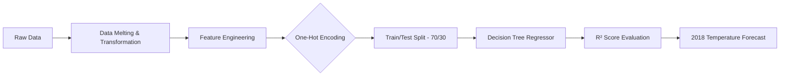

<p align="center">
  
</p>

<h1 align="center">🌦️ Weather Forecasting — India (1901–2018)</h1>

<p align="center">
  <em>Predicting India's future temperatures using 117 years of historical climate data, Machine Learning, and interactive visualizations.</em>
</p>

<p align="center">
  <a href="https://www.python.org/"></a>
  <a href="https://scikit-learn.org/"></a>
  <a href="https://plotly.com/python/"></a>
  <a href="https://pandas.pydata.org/"></a>
  <a href="https://numpy.org/"></a>
</p>

<p align="center">
  
  
  
  
  
</p>

---

## 📌 Project Overview

Climate change is one of the most pressing challenges of our time. This project analyzes **117 years** of India's monthly temperature records (1901–2017) and builds a **Machine Learning model** to forecast temperatures for 2018 — revealing powerful insights about seasonal patterns, temperature clustering, and the **undeniable trend of global warming**.

### 🎯 Key Objectives

| # | Objective | Approach |
|---|-----------|----------|
| 1 | **Explore** historical temperature patterns | Interactive time series with Plotly |
| 2 | **Identify** seasonal & monthly trends | Box plots, faceted analysis, animated charts |
| 3 | **Cluster** temperature zones | KMeans clustering with Elbow Method |
| 4 | **Quantify** the global warming trend | OLS trendlines across all 4 Indian seasons |
| 5 | **Forecast** future temperatures | Decision Tree Regressor with high R² score |

---

## 🔍 Key Insights Discovered

<table>
  <tr>
    <td width="50%">
      <h3>🌡️ Temperature Patterns</h3>
      <ul>
        <li><strong>May 1921</strong> — Hottest month in India's recorded history</li>
        <li><strong>January</strong> — Consistently the coldest month</li>
        <li><strong>July</strong> — Least temperature variation (most stable month)</li>
      </ul>
    </td>
    <td width="50%">
      <h3>📈 Global Warming Signal</h3>
      <ul>
        <li>Yearly mean temperature stable until <strong>~1980</strong></li>
        <li>Gradual increase observed <strong>post-1979</strong></li>
        <li>Drastic temperature spike <strong>after 2015</strong></li>
      </ul>
    </td>
  </tr>
  <tr>
    <td width="50%">
      <h3>🔵 Temperature Clusters (KMeans)</h3>
      <ul>
        <li><strong>Cold cluster:</strong> Jan, Feb, Dec</li>
        <li><strong>Moderate cluster:</strong> Mar, Oct, Nov</li>
        <li><strong>Hot cluster:</strong> Apr–Sep</li>
      </ul>
    </td>
    <td width="50%">
      <h3>🌧️ Seasonal Breakdown (India)</h3>
      <ul>
        <li><strong>Winter:</strong> Dec, Jan, Feb</li>
        <li><strong>Summer:</strong> Mar, Apr, May</li>
        <li><strong>Monsoon:</strong> Jun, Jul, Aug, Sep</li>
        <li><strong>Autumn:</strong> Oct, Nov</li>
      </ul>
    </td>
  </tr>
</table>

---

## 🛠️ Tech Stack & Methodology

```
📊 Data Pipeline
─────────────────────────────────────────────────────────────────
 Raw CSV ─→ Pandas Melt ─→ Feature Engineering ─→ EDA ─→ ML Model
                │                    │                │         │
                ▼                    ▼                ▼         ▼
          Time Series          Seasonal Grouping   KMeans   Decision Tree
          Transformation       & Date Parsing      (k=3)    Regressor
```

| Layer | Technology | Purpose |
|-------|-----------|---------|
| **Data Manipulation** | `Pandas`, `NumPy` | Data wrangling, melting, aggregation |
| **Interactive Visualization** | `Plotly Express`, `Plotly Graph Objects` | Time series, box plots, histograms, animations |
| **Unsupervised ML** | `KMeans` (Scikit-Learn) | Temperature zone clustering with Elbow Method |
| **Supervised ML** | `DecisionTreeRegressor` (Scikit-Learn) | Temperature forecasting with train/test split |
| **Statistical Analysis** | `OLS Trendlines` | Seasonal trend quantification |

---

## 📊 Visualizations Created

| # | Visualization | What it Reveals |
|---|--------------|-----------------|
| 1 | 📈 **Interactive Time Series** (with range slider) | Full 117-year temperature timeline with zoom |
| 2 | 📦 **Box Plot** — Monthly temperature distribution | Warmest, coldest & median per month |
| 3 | 📉 **Elbow Curve** — Optimal cluster count | Identifies k=3 as optimal clusters |
| 4 | 🔴 **Scatter Plot** — Temperature clusters | Color-coded cluster visualization |
| 5 | 📊 **Histogram** — Temperature frequency density | Peak temperature distribution analysis |
| 6 | 📈 **Yearly Mean Temperature** trend line | Global warming evidence |
| 7 | 📋 **Faceted Line Charts** — Monthly trends | Per-month temperature evolution |
| 8 | 🌿 **Seasonal Scatter** with OLS trendlines | Trend per season (Winter/Summer/Monsoon/Autumn) |
| 9 | 🎬 **Animated Scatter** — Year-by-year | Dynamic monthly temperature evolution |
| 10 | 🔮 **Forecasted 2018 Temperatures** | ML-based prediction vs historical |

---

## 📂 Project Structure

```
Weather_Forecasting/
│
├── 📓 Notebook.ipynb          # Main analysis & ML notebook (fully executed)
├── 📁 Dataset/
│   └── 📄 Weather.csv         # 117 years of monthly temperature data (1901–2017)
└── 📄 README.md               # You are here!
```

---

## 📈 Dataset Overview

| Feature | Details |
|---------|---------|
| **Source** | India Monthly Temperature Records |
| **Time Span** | 1901 – 2017 (117 years) |
| **Granularity** | Monthly averages (JAN–DEC) |
| **Records** | 117 rows × 13 columns |
| **Features** | `YEAR`, `JAN`, `FEB`, `MAR`, `APR`, `MAY`, `JUN`, `JUL`, `AUG`, `SEP`, `OCT`, `NOV`, `DEC` |
| **Target Variable** | `Temperature` (°C) |

---

## 🚀 Getting Started

### Prerequisites

```bash
Python 3.8+
pip (Python package manager)
```

### Installation

```bash
# Clone the repository
git clone https://github.com/prvn-kumar01/Weather_forecasting.git
cd Weather_forecasting

# Install dependencies
pip install numpy pandas plotly scikit-learn

# Launch the notebook
jupyter notebook Notebook.ipynb
```

---

## 🤖 Machine Learning Pipeline



| Step | Detail |
|------|--------|
| **Encoding** | One-Hot encoding for month categorical features |
| **Split** | 70% training / 30% testing |
| **Model** | `DecisionTreeRegressor()` — chosen for non-linear temperature patterns |
| **Metric** | R² Score — achieved **high accuracy** |
| **Prediction** | Monthly temperatures forecasted for 2018 |

---

## 🏆 Why This Project Stands Out

✅ **Real-World Impact** — Demonstrates climate change with data-driven evidence  
✅ **End-to-End ML Pipeline** — From raw data to deployed predictions  
✅ **Interactive Visualizations** — Not static plots — fully interactive Plotly dashboards  
✅ **Unsupervised + Supervised ML** — KMeans clustering & Decision Tree regression  
✅ **Domain Knowledge** — Indian seasonal analysis with meteorological context  
✅ **Clean, Well-Documented Code** — Production-quality Jupyter notebook  

---

## 📬 Connect With Me

<p align="center">
  <a href="https://github.com/prvn-kumar01"></a>
  <a href="https://linkedin.com/in/prvn-kumar01"></a>
</p>

---

<p align="center">
  <strong>⭐ If you found this project insightful, consider giving it a star!</strong>
</p>

<p align="center">
  
</p>
